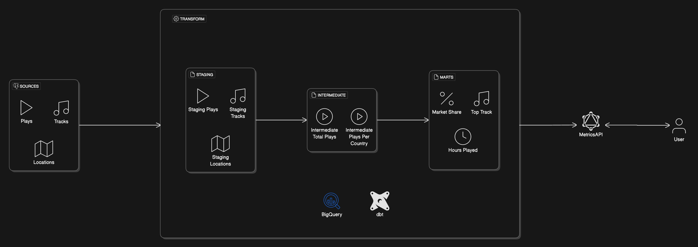

# Licensor Metrics

A data pipeline that enables music licensor to obtain metrics and insights on music they license. 

## Architecture Overview

The pipeline processes music streaming data through multiple stages:

1. **Sources Layer**
   - Collects raw play events, track information, and location data

2. **Transform Layer (dbt)**
   - Processes staging data using dbt transformations
   - Leverages BigQuery for data warehousing
   - Creates intermediate tables for total plays and country-specific metrics

3. **Metrics Layer**
   - Calculates key business metrics:
     - Market share analysis
     - Top track rankings
     - Hours played
     - Country-specific streaming statistics

4. **API Layer**
   - Exposes processed data through a GraphQL API
   - Built with ZIO and Caliban
   - Serves metrics to end-user applications

## Tech Stack

- **Orchestration**: Dagster
- **Data Warehouse**: BigQuery
- **Transformation**: dbt
- **API**: 
  - ZIO (Scala functional programming)
  - Caliban (GraphQL)

## Data Flow

`Sources → Transform → Intermediate Tables → Metrics → GraphQL API → End Users`

The pipeline processes raw streaming data into actionable business metrics, with full orchestration and monitoring through Dagster.